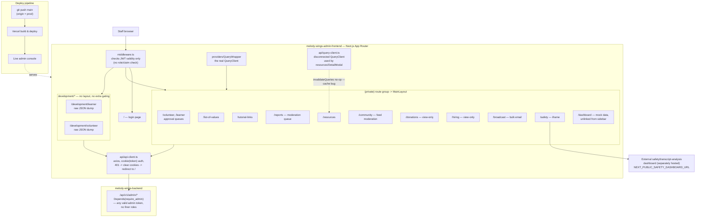
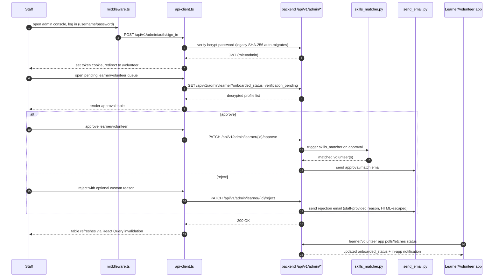

# melody-wings-admin-frontend

Next.js (App Router) internal staff console for **Melody Wings** — approvals, content moderation, donations, hiring, broadcast email, and a safety dashboard. Talks exclusively to the admin routes of [melody-wings-backend](../melody-wings-backend).

## Tech stack

| Layer | Technology |
|---|---|
| Framework | Next.js 15 (App Router), TypeScript |
| Data fetching / cache | `@tanstack/react-query` v5 |
| State | `zustand`, `nuqs` |
| UI | `antd`, `@mui/material`, `lucide-react` |
| Forms/content | `zod`, `@tiptap/react` (rich text for broadcast email), `react-quill-new` |
| Charts | `apexcharts` / `react-apexcharts` (dashboard — currently mock data) |
| Auth | Username/password (bcrypt) against the backend's admin auth routes; `jwt-decode` + `js-cookie` client-side |
| Deploy | Vercel |

## Architecture



**Auth gating**: `middleware.ts` only checks whether the `token` cookie decodes to a non-expired JWT — there is no role/claim inspection anywhere in this app or the backend's `require_admin` dependency it calls into. Any authenticated admin account has identical access to every page, including the `development/*` raw-data-dump pages (they sit outside the `(private)` route group's layout but are still behind the same all-or-nothing middleware check).

## End-to-end flow

A full approval cycle — staff login through a learner/volunteer seeing the result — showing how this app, the backend, and the matching/notification pipeline connect:



## Directory structure

```
src/app/
  page.tsx                 # "/" — login page
  (private)/                # MainLayout-wrapped staff console
    layout.tsx
    volunteer/, learner/     # approval lists
    reports/, community/     # moderation
    resources/, tutorial-links/, list-of-values/
    donations/, hiring/      # view-only
    broadcast/               # bulk email compose/send
    safety/                  # iframe to external dashboard
    dashboard/                # mock data, not linked in Sidebar
  development/               # NOT in (private) group — raw JSON dumps, same auth gate only
    learner/, volunteer/

src/api/
  api-client.ts             # axios instance, cookie auth, 401 handling
  query-client.ts           # a second, disconnected QueryClient (see Known gaps)
  reports/, resources/       # domain-specific API helpers

src/providers/QueryWrapper/  # the actual QueryClientProvider used by the app
src/components/Sidebar/      # nav (Dashboard link is commented out here)
```

## Known gaps

- **No role-based access control.** Every admin account can reach every page and every admin API route — including account deletion, admin-account creation, and the unpaginated `development/*` data dumps. This mirrors the backend's current authorization model (`require_admin` is a single boolean, not a tiered role).
- **Stray `QueryClient` cache bug**: `src/api/query-client.ts` exports its own `QueryClient`, separate from the one the app's `QueryWrapper` provider actually uses. `src/components/resources/DetailModal/index.tsx` imports the stray instance and calls `invalidateQueries` on it — a silent no-op, so the resources list doesn't refresh after an edit from that modal. (List-of-values and tutorial-links pages correctly use `useQueryClient()` from context.)
- **`/dashboard`** is fully mock data (every metric card hardcodes the same placeholder number, no endpoint wired) and isn't linked from the sidebar — reachable only by direct URL.

See `AUDIT-REPORT.md` and `PERFORMANCE-AUDIT-REPORT.md` in the workspace root for the fuller audit history and what's already been remediated elsewhere in the platform.

## Running locally

```bash
npm install
npm run dev   # http://localhost:3000 (or configured port)
```

Set `NEXT_PUBLIC_API_URL` to point at a running [melody-wings-backend](../melody-wings-backend), and `NEXT_PUBLIC_SAFETY_DASHBOARD_URL` for the `/safety` iframe to render anything other than its "not configured" fallback state.
